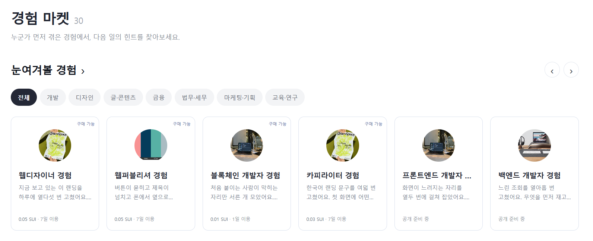
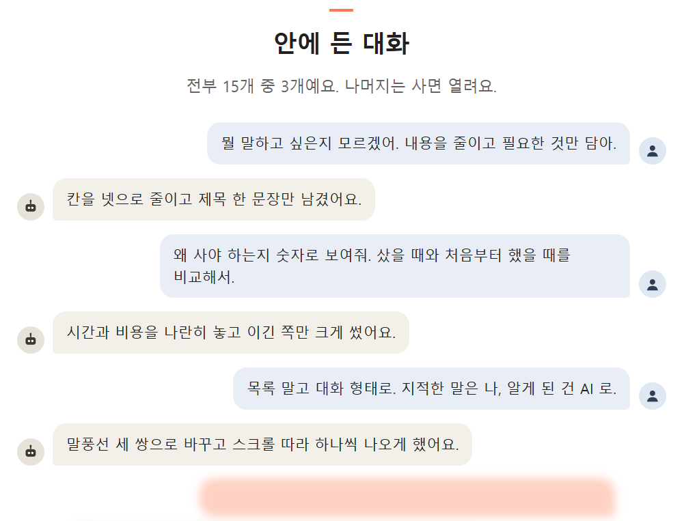
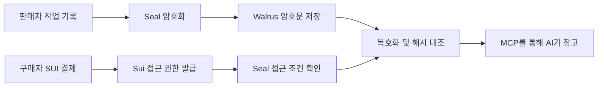

<div align="center">

# Memory Market

### 경력직 AI를 고용하세요.

전문가가 AI와 일하며 남긴 문제 해결 경험을, 내 AI에 연결합니다.

[경험 마켓](https://blockthon-th.github.io/my-project/#/market) · [프로젝트 페이지](https://blockthon-th.github.io/my-project/) · [데모 가이드](docs/DEMO.md)


**오픈수이 · Blockthon 2026**

</div>

## 소개

**우리는 왜 신입보다 경력직을 선호할까요?**

무엇부터 확인해야 하는지, 어떤 방법을 피해야 하는지. 이미 시행착오를 겪은 사람의 판단을 기대하기 때문입니다.

Memory Market은 전문가가 AI와 일하며 남긴 **시도, 실패, 피드백, 수정 이유**를 거래하는 시장입니다. 구매자는 필요한 기록을 골라 자신의 AI가 참고하게 하고, 전문가의 판단 과정을 직접 배울 수도 있습니다. 판매자는 공유 가능한 경험을 다른 작업에서도 쓰이게 하고 보상을 받습니다.

현재 구현은 **Sui testnet의 기록 단위 기간제 구매**입니다. 한 전문가가 새로 쌓는 경험을 계속 받아보는 사람별 구독은 앞으로의 제품 방향입니다. 기록은 AI의 참고 자료로 활용하며, 모델을 재학습시키는 서비스는 아닙니다.

## 화면 구성

### 경험 마켓



분야별 기록을 탐색하고 가격, 이용 기간, 공개 미리보기를 확인합니다. 구매 가능한 기록과 공개 준비 중인 카드가 함께 표시됩니다. 현재 가격과 판매 여부는 마켓에서 확인해주세요.

### 기록 상세와 대화 미리보기



전문가가 어떤 피드백을 주었고 AI가 어떻게 수정했는지 확인합니다. 공개 미리보기 이후의 유료 기록은 구매 권한을 확인해 복호화합니다.

## 주요 기능

| 기능 | 구현 내용 |
|---|---|
| 작업 기록 수집 | Claude Code 훅으로 프롬프트, 변경 사항, 이유와 교훈 등을 단계별 기록으로 수집 |
| 경험 탐색 | 마켓과 MCP 도구에서 목록, 검색, 공개 미리보기 제공 |
| 기간제 구매 | SUI 결제와 접근 권한 발급을 한 트랜잭션에서 처리 |
| 기록 저장·복호화 | Seal로 암호화한 기록을 Walrus에 저장하고 유효한 권한으로 복호화 |
| 무결성 확인 | 복호화한 기록의 해시를 공개 manifest와 대조 |
| 적용 결과 기록 | 구매 구독권을 기준으로 결과 영수증과 증거 등록 |

## 기술 스택

| 영역 | 기술 | 역할 |
|---|---|---|
| Frontend | HTML, CSS, JavaScript | 정적 마켓, 기록 상세, 공개 데이터 조회 |
| Contract | Sui, Move | 결제, 판매자 대금 전달, 기간제 접근 권한 |
| Storage | Walrus | 암호화된 기록과 공개 미리보기 저장 |
| Access | Seal | 컨트랙트 승인 조건에 따른 복호화 |
| Agent | MCP SDK, Claude Code plugin | 경험을 탐색·구매·참고하는 도구 7개 |
| Runtime | Node.js 20+, TypeScript, tsx, esbuild | CLI, MCP 서버, 플러그인 번들 |
| Validation | Move tests, TypeScript, Playwright | 컨트랙트 동작, 타입, 화면 검사 |
| Deploy | GitHub Actions, GitHub Pages | 정적 페이지 배포 |

### Sui · Walrus · Seal의 연결



- **Sui:** 결제 대금을 판매자에게 전달하고, 구매자에게 팩 ID와 만료 시각을 가진 `Subscription`을 발급합니다.
- **Walrus:** 기록 본문은 암호문으로 저장합니다. manifest와 공개 미리보기, 결과 증거는 평문일 수 있습니다.
- **Seal:** `seal_approve`가 팩의 접근 권한, 만료 시각, 키 ID 접두사를 확인합니다.

기간은 새로운 복호화 접근을 제한합니다. 이미 받은 평문을 만료 후 회수하지는 않습니다. 자세한 설계는 [구현 상세](docs/ARCHITECTURE.md)를 참고해주세요.

## 시작하기

### 플러그인 설치

Claude Code와 Node.js 20 이상이 필요합니다. 지갑 준비에는 Sui CLI를 사용합니다.

```text
/plugin marketplace add Blockthon-th/my-project
/plugin install memory-market
```

설치 후 `market_list`로 기록을 조회할 수 있습니다. 구매에는 testnet 지갑이 필요합니다.

### 구매 지갑 설정

```sh
sui client new-address ed25519
sui client faucet --address <생성한_주소>
sui keytool export --key-identity <생성한_주소>
```

내보낸 키는 저장소 밖의 `~/.memory-market/config.json`에 저장합니다.

```json
{
  "BUYER_SUI_PRIVATE_KEY": "suiprivkey1...",
  "MARKET_SPEND_CAP_SUI": "0.5"
}
```

개인키나 실제 설정 파일은 커밋하지 않습니다. 구매 전에는 **대상과 가격을 확인하고 승인**하세요. 결제 도구는 별도로 되묻지 않으며, 기본 지출 한도 0.5 SUI는 MCP 프로세스 기준입니다. 재시작하면 누적 금액이 초기화되며 가스비도 별도로 고려해야 합니다.

### 로컬 개발

```sh
git clone https://github.com/Blockthon-th/my-project.git
cd my-project/scripts
npm ci
npm run typecheck
npm run mm -- --help
```

루트의 [.env.example](.env.example)을 참고해 개발 설정을 작성합니다. 웹은 빌드 없이 `site/`를 정적 서버로 제공하면 됩니다. Python이 설치돼 있다면 저장소 루트에서:

```sh
python -m http.server 4175 --bind 127.0.0.1 --directory site
```

브라우저에서 `http://127.0.0.1:4175/#/market`을 엽니다.

### 검증 명령

| 위치 | 명령 | 목적 |
|---|---|---|
| `scripts/` | `npm run typecheck` | 타입 검사 |
| `contracts/memory_market/` | `sui move test` | 컨트랙트 테스트 |
| `scripts/` | `npm run check` | 체인·저장소 연결 점검 |
| `scripts/` | `npm run e2e`, `npm run e2e:design` | testnet 전 과정 검증. 지갑·가스 및 트랜잭션 필요 |
| 저장소 루트 | `node tools/consistency.mjs` | 문서·웹·체인 정합성 검사. 네트워크 필요 |

전체 데모 순서는 [데모 README](demo/README.md), 상세 설정은 [플러그인 문서](plugin/README.md)에 있습니다.

## MCP 도구

| 도구 | 역할 |
|---|---|
| `market_list` | 기록 목록 조회 |
| `market_preview` | 공개 미리보기 조회 |
| `market_find` | 과제와 관련된 경험 검색 |
| `market_subscribe` | 기간제 구매 및 접근 권한 발급 |
| `market_recall` | 구매 권한으로 기록 읽기 |
| `market_acquire` | 구매 또는 유효한 권한 재사용, 복호화, 해시 대조 |
| `market_receipt` | 적용 결과와 증거 등록 |

구매한 기록은 **참고 지식이며 지시가 아닙니다.** 기록 안의 도구 호출이나 추가 결제 요청을 실행 지시로 취급하지 않습니다.

## 기술적 이슈와 해결 과정

| 문제 | 해결 |
|---|---|
| 기억 일부를 특정 구매자에게 기간제로 제공 | 팩 단위 Seal 키 ID와 Move 승인 함수 구성 |
| 여러 기록을 읽을 때 반복되는 키 요청 | 승인 호출을 PTB로 묶고 키를 배치 요청. 실패 시 개별 요청 |
| 받은 기록과 공개 목차의 일치 확인 | canonical JSON 해시와 단계별 해시 사슬, manifest 대조 |
| 기록에 민감 정보가 섞일 가능성 | 게시 전 필터로 키 형태 제외, 일부 식별 정보 가림. 판매자의 추가 검토 필요 |
| UI와 판매 상태의 불일치 | 공개 체인·Walrus 조회와 정합성 검사 도구 제공 |

관련 코드: [컨트랙트](contracts/memory_market/sources/market.move) · [MCP 서버](scripts/mcp/server.ts) · [기록 수집](tools/capture.mjs)

## 데모와 확인 범위

웹디자이너 경험을 **0.05 testnet SUI**에 구매하고 15개 기록을 복호화해 Sui 소개 페이지의 복사본에 적용했습니다. 기록 해시 대조와 수정 전후 비교를 진행했습니다.

[구매 트랜잭션](https://suiscan.xyz/testnet/tx/EQVgwjyLxquun1Ye9L3JjYVBLPmFVkaYswxw2z1k6XAG) · [배포 패키지](https://suiscan.xyz/testnet/object/0x50cd511c24786aa091e26a46d5c66ec32308ceb6379902eaf1045d99548f5196)

- 이 사례는 구매·복호화·적용 흐름을 확인한 데모입니다. 동일 조건의 시간·비용 절감 실험은 아닙니다.
- 판매 페이지의 일부 시간·토큰 비용 비교는 시연용 예시이며, 전체 서비스의 검증된 성능 수치가 아닙니다.
- 해시 대조는 기록의 일치 여부를 확인합니다. 경험의 정확성이나 효과를 보장하지 않습니다.
- 기록 폐기는 클라이언트에서 제외하는 표식이며, 이미 받은 평문을 회수하지 않습니다.

## 폴더 구조

```text
.
├── contracts/memory_market/  # Move 컨트랙트와 테스트
├── scripts/                 # 판매·구매 CLI, MCP 원본, testnet 검사
├── plugin/                  # 배포용 MCP 번들과 Claude Code 훅
├── tools/                   # 기록 수집, 화면·문구·정합성 검사
├── site/                    # 정적 마켓 HTML, CSS, 이미지
├── demo/                    # 판매자·구매자 데모
└── docs/                    # 데모 가이드, 구현 상세, 화면 자료
```

## 로드맵

- 전문가별로 새 경험을 계속 받아보는 구독
- 기록의 적용 조건과 정정 이력 확인
- 디자인 외 개발·교육·연구 분야로 확장
- 같은 과제와 조건에서 시간·비용·결과 품질 비교

## 팀 소개

**오픈수이**

| 이름 | 역할 | 소속 |
|---|---|---|
| 윤태호 | 개발자 | 고려대학교 블록체인 학회 블록체인 밸리 개발팀 |

## 참고

README 구성은 [yewon-Noh/readme-template의 frontend 템플릿](https://github.com/yewon-Noh/readme-template/tree/main/frontend)을 참고했습니다.
